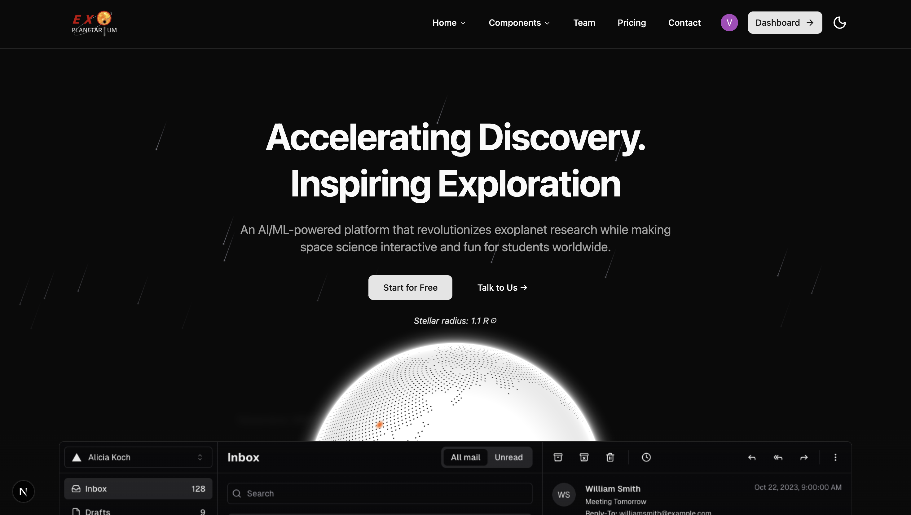
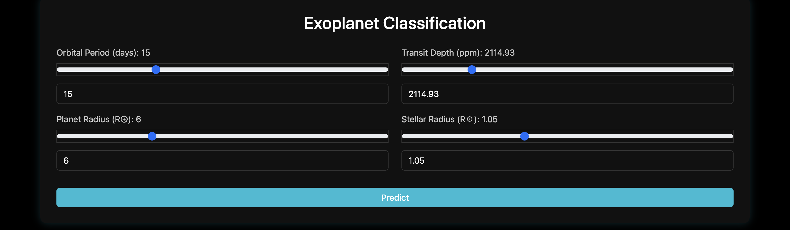
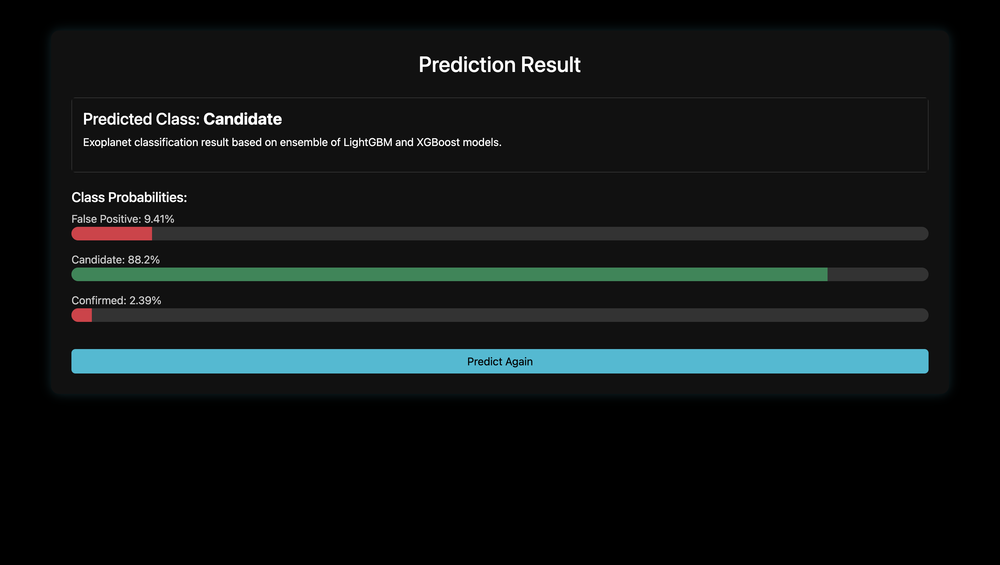
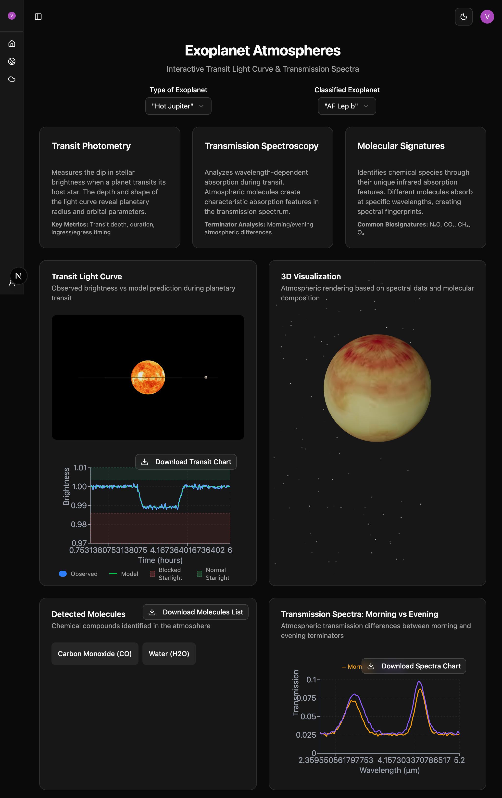
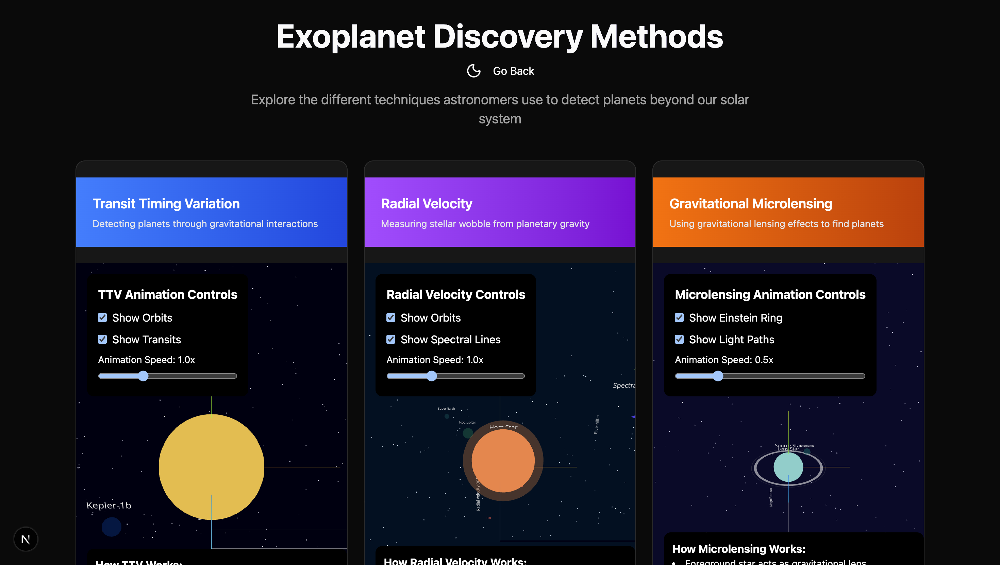
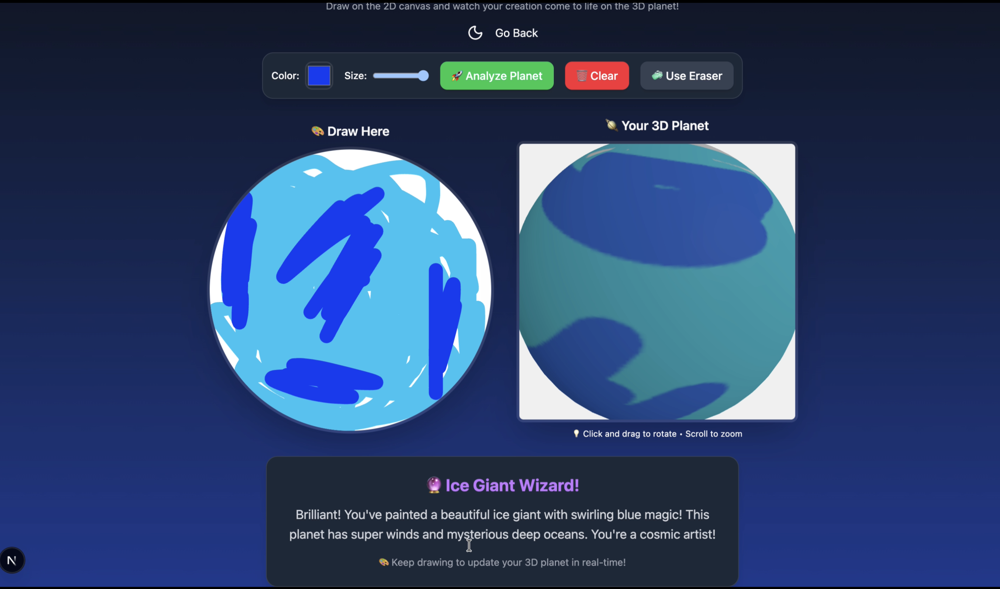
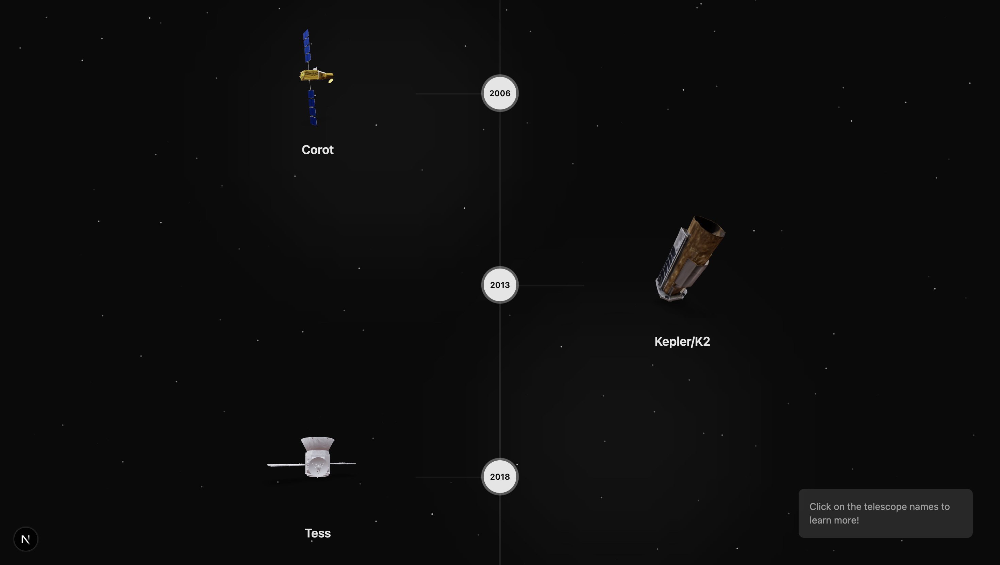

# Exoplanetarium: An AI Platform for Exoplanet Discovery & Education

#### 🪐 Event - NASA Space Apps Challenge 2025 [Noida]
#### 👨‍🚀 Team Name - CODE4CHANGE
#### 💡 Problem Statement - *A World Away: Hunting for Exoplanets with AI*
#### 📩 Team Leader Email - debshatachoudhury@gmail.com

---

## 🌠 A Brief of the Prototype
  
**Exoplanetarium** is a next-generation **AI-powered web platform** designed to explore, classify, and visualize exoplanets discovered through NASA's missions.  

It brings together *machine learning, astrophysics, and interactive visualization* to make the study of exoplanets engaging for **students, researchers, and astronomy enthusiasts** alike.  

The platform automates the classification of exoplanetary candidates, simulates atmospheric and orbital properties, and visualizes telescope missions—all within a single unified interface.  

By leveraging *NASA's open-source datasets* and *AI models*, the project enables automatic exoplanet identification while offering educational, visual, and research-focused tools for users.  

---

## 🌍 Modules Overview

### 🧠 1. Exoplanet Classification Tool (Flask App)
  
  
A **web-based ML classifier** that predicts whether an object is a **Confirmed Planet, Candidate, or False Positive**.  
- Accepts astrophysical parameters like *orbital period*, *transit depth*, *planet radius*, and *stellar radius*.  
- Utilizes **LightGBM** and **XGBoost** ensemble models for robust predictions.  
- Displays classification confidence scores through an intuitive interface.  

> 💡 In short, it's an intelligent prediction system powered by ensemble learning for exoplanet classification.

---

### ☁️ 2. Exoplanet Atmosphere Visualization API
  
A **Flask-based API** for retrieving and visualizing exoplanet atmosphere data.  
- Loads and normalizes CSV datasets from NASA archives.  
- Generates **synthetic transit and spectral curves** when data is incomplete.  
- Detects and lists key molecules (H₂O, CO₂, CH₄, etc.) in planetary atmospheres.  

**Main Endpoints**
```
/api/types      → Returns available planet types
/api/planets    → Lists planets by type
/api/data       → Returns detailed atmospheric & spectral data
```

> 🌌 This backend service powers the interactive visualizations in the frontend dashboard.

---

### 🔭 3. Exoplanet Discovery Methods (Educational Web App)
  
An **interactive educational module** built with **Next.js + Tailwind CSS**, showcasing five exoplanet detection techniques:  
- Transit Timing Variation (TTV)  
- Radial Velocity  
- Microlensing  
- Direct Imaging  
- Astrometry  

**Key Features**
- Animated, gradient-themed cards for each discovery method  
- Responsive grid layout with light/dark mode  
- Framer Motion animations and hover interactions  

> 🎓 Designed for education, it simplifies complex astronomical techniques through visuals and interactivity.

---

### 🎨 4. Interactive 3D Planet Creator
  
A **creative AI-powered experience** allowing users to **draw and generate planets**.  
- Users sketch planetary textures on a circular canvas.  
- Real-time 3D sphere preview powered by **Three.js**.  
- **Google Gemini AI** analyzes colors to classify the planet (Terrestrial, Super-Earth, Gas Giant, etc.).  
- Educational explanations of each type are provided in real-time.  

**Tech Highlights**
- React Sketch Canvas + Three.js  
- AI Classification via Gemini  
- Responsive design across devices  

> 🧑‍🎨 Makes astronomy accessible and fun for all ages by merging creativity with science.

---

### 🛰️ 5. Exoplanet Telescope Timeline
  

An **interactive 3D timeline** showcasing major telescope missions from *Hubble (1990)* to *Ariel (2029)*.  
- Chronological animation with glowing markers  
- Clickable 3D telescope models (.glb)  
- Pop-up mission data and launch history  
- Particle-based space background for immersion  

> 🕰️ Offers users an engaging way to explore the evolution of exoplanet discovery missions.

---

## 🧰 Tech Stack

| Layer | Technologies |
|-------|-------------|
| **Frontend** | Next.js · TypeScript · Tailwind CSS · ShadCN UI · Three.js · Plotly.js · Framer Motion |
| **Backend** | Flask · Flask-CORS |
| **Authentication** | Clerk Auth |
| **AI & ML** | CNN · XGBoost · LightGBM · PCA / t-SNE · K-Means · DBSCAN · Isolation Forest · Autoencoders |
| **APIs & Add-Ons** | NASA Exoplanet Archive API · WebGL (3D Rendering) |
| **Deployment** | Vercel (Frontend) · Render (Backend) |

---

## 👨‍👩‍👧‍👦 Meet the Team – CODE4CHANGE

| Member | Role |
|--------|------|
| **Debshata Choudhury** | Team Lead / Data Analyst |
| **Niranjan Praveen** | Frontend Engineer / Version Control Specialist |
| **Vaibhav Jain** | Frontend Engineer / API Engineer |
| **Abhishek Chaubey** | 3D Visualization Specialist |
| **Pratham Ranjhan** | AI/ML Engineer |
| **Shreyansh Jaiswal** | AI/ML Engineer / Solutions Architect |

> ✨ Together, Team CODE4CHANGE envisions making **space science more interactive, data-driven, and accessible** through cutting-edge web technologies and AI.

---

## 🧩 Code Execution Instructions

### ▶️ How to Run the Frontend (Next.js)
```bash
# 1. Clone the Repository
git clone https://github.com/YourUsername/exoplanetarium.git
cd exoplanetarium

# 2. Install Dependencies
npm install

# 3. Start the Development Server
npm run dev

# 4. Access the Application
Visit http://localhost:3000 in your browser
```

### 🧠 How to Run the Backend (Flask API)
```bash
# 1. Navigate to the Backend Folder
cd server/tools

# 2. Install Required Packages
pip install -r requirements.txt

# 3. Start the Flask Server
python app.py
```

---

## 🚀 Future Plans

- Integration of **real-time NASA mission feeds**
- Enhanced **mobile accessibility and VR mode**
- Addition of **hyperparameter tuning** through the interface
- Community module for **uploading and benchmarking custom models**
- Continuous learning pipeline for improving classification accuracy

---

## 🌌 Why It Matters

Exoplanetarium bridges the gap between **astronomy research** and **AI-driven interactivity**.

By merging machine learning with cosmic data, it transforms how researchers and students explore planets beyond our solar system — **making space science more immersive, automated, and understandable**.  

> "Exploring worlds beyond our own begins with understanding the data that reveals them."

---